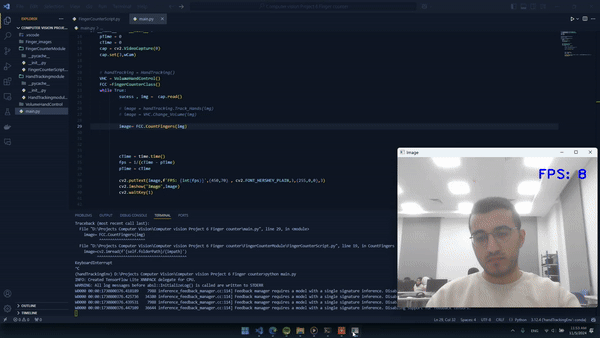

# 6 Finger Counter  - Computer Vision Project

This project is a **computer vision-based application** that implements **finger counting** . The project uses **OpenCV**, **Mediapipe**, and **Python** to detect hand landmarks, enabling real-time interaction through hand gestures. It also includes modules for tracking hands, counting fingers, and adjusting system volume based on detected gestures.

## Table of Contents
- [Features](#features)
- [Demo](#demo)
- [Installation](#installation)
- [Usage](#usage)
- [Project Structure](#project-structure)
- [Requirements](#requirements)
- [Contributing](#contributing)
- [License](#license)

## Features
- **Hand Tracking**: Tracks hand movements and positions in real-time.
- **Finger Counting**: Detects and displays the number of fingers held up in front of the camera.
- **Flexible Parameters**: Adjustable confidence levels for hand detection and tracking.

## Demo
  <!-- Include a demo image or video showing the features -->

## Installation
1. **Clone the repository**
   ```bash
   git clone https://github.com/abou-zithar/Computer-vision-Project-6-Finger-counter.git
   cd Computer-vision-Project-6-Finger-counter
    ```
## install required libraries (consider using a virtual environment)
```bash

pip install -r requirements.txt
```
## Run the Application

``` bash
python main.py
```
## Instructions:

- Ensure your hand is visible to the camera.
- The application will display the number of fingers detected and adjust the system volume based on hand gestures.
- You can adjust parameters in the code for optimal performance based on lighting and camera quality.

## Project Structure
- `main.py`: Main script to run the finger counting and volume control application.
- `FingerCounterModule/`: Contains the `FingerCounterClass` for finger counting functionality.
- `HandTrackingmodule/`: Contains the `HandTracking` class to detect and track hand landmarks using Mediapipe.
- `Finger_images/`: Stores images related to finger counting (if any).
- `Finger counter output.mp4`: Sample output video of the project in action (if available).
-  `requirements.txt`: List of dependencies required for the project.

## Requirements
- Python 3.x
- OpenCV
- Mediapipe
- Pycaw
- Numpy

For a complete list, refer to the `requirements.txt` file.


## Contributing
Feel free to submit issues, fork the repository, and make a pull request if you'd like to contribute. Any suggestions for improvement are welcome!

## License
This project is licensed under the MIT License. See the LICENSE file for details.

